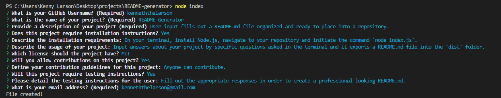

# README Generator

  

  ## Description
  A Node application that uses command line prompts to generate a README.md file for users to add to their GitHub projects.

  ## Table of Contents
  * [Installation](#installation)
  * [Usage](#usage)
  
  ## Installation
  - Clone repository
  - Navigate to project root directory in terminal
  - Run the "npm init" command
  - Run the "node index" command

  ## Usage
  Using this node app will simplify the creation of a ReadMe.md file for a GitHub project. By answering simple command line prompts a file will be generated automatically and put into the "dist" folder.

  See the following video for a demonstration: [demo](https://drive.google.com/file/d/1eS2FpX3n678BBnUgWeim9uIW8NBp7G8F/view?usp=sharing)

  ## Questions
  Created by: [kenneththelarson](https://github.com/kenneththelarson)
  
  For further questions please contact [kenneththelarson@gmail.com](mailto:kenneththelarson@gmail.com)

